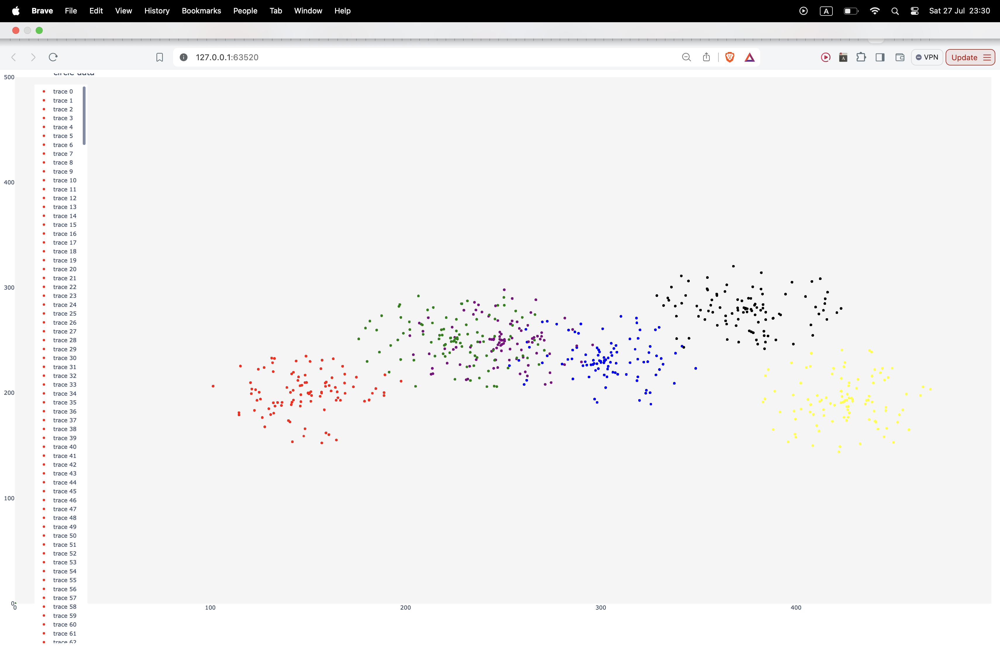
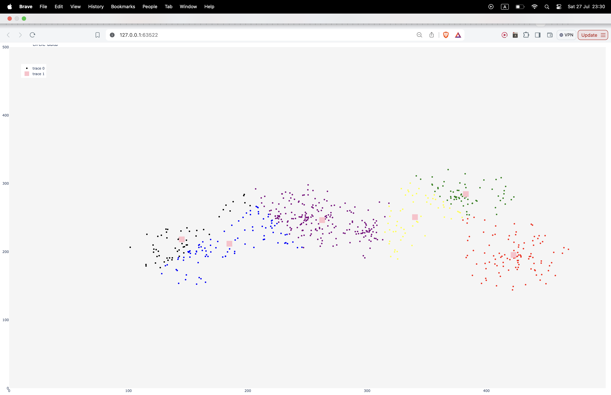
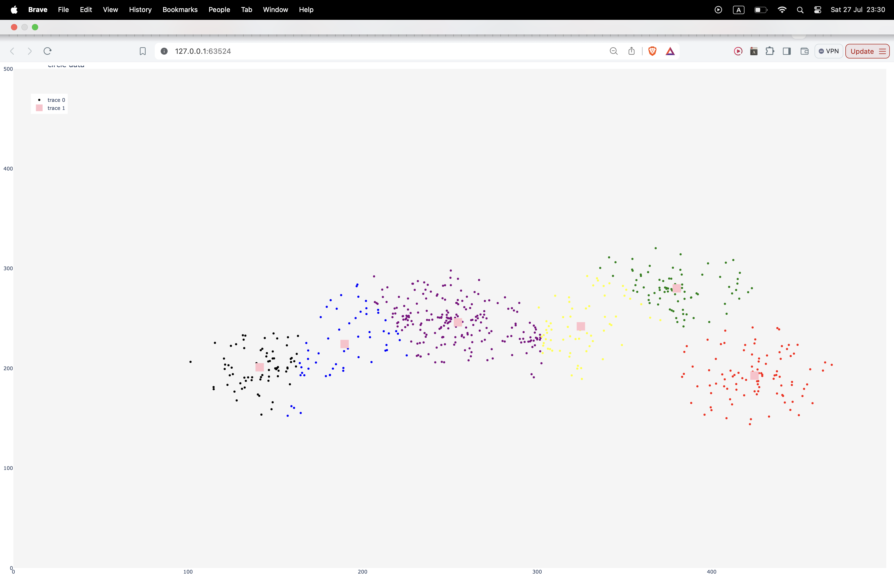
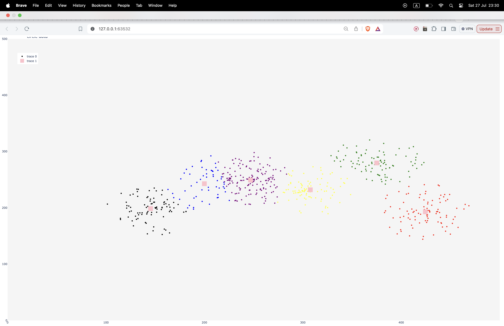
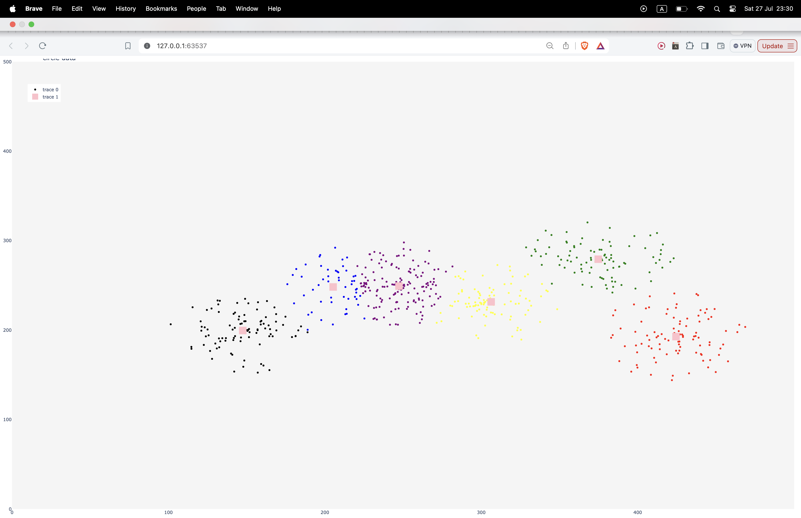
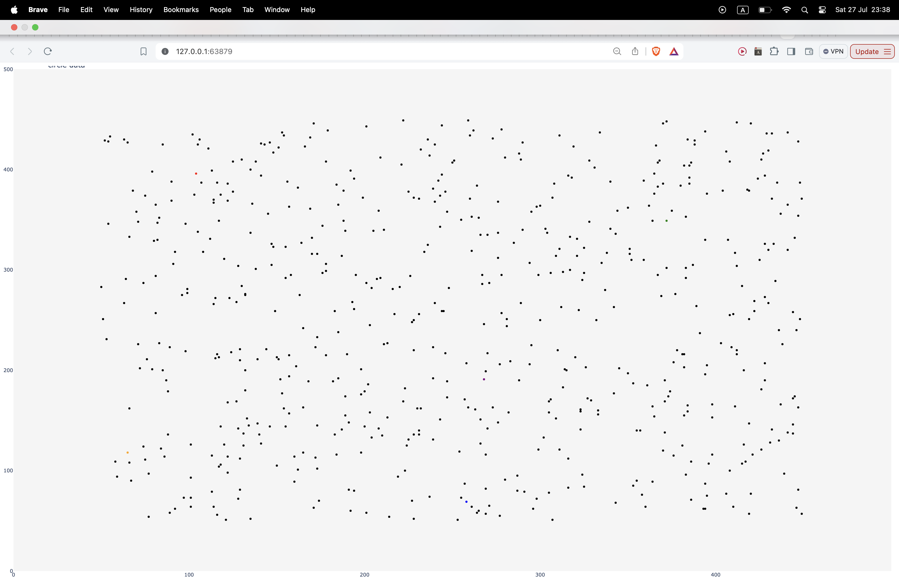
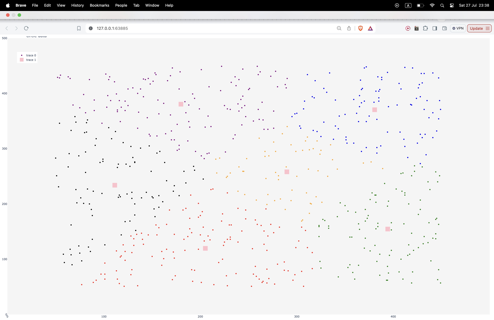
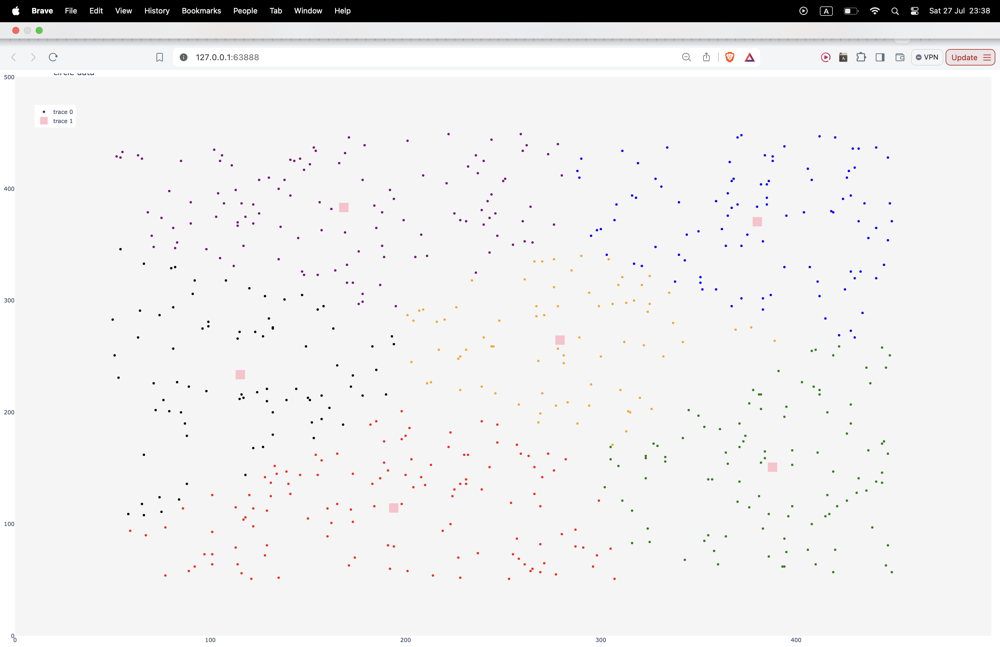
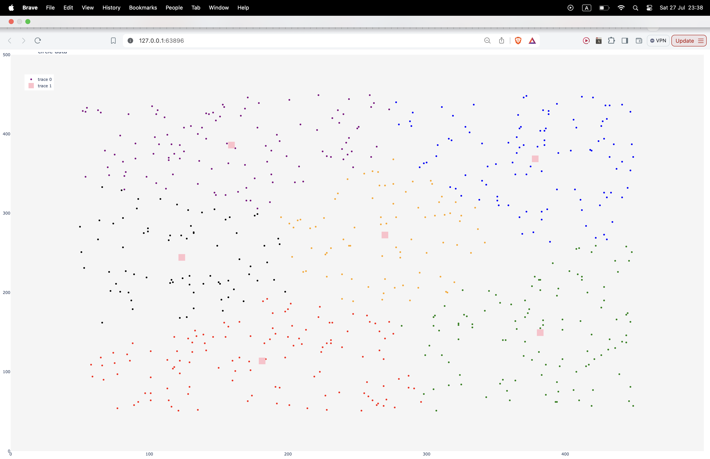

# 📊 K-Means Clustering with 2D Data

## 🔍 Introduction

This project demonstrates the use of the K-Means clustering algorithm to group data points based on their x and y features. The goal is to visually represent the data and the resulting clusters using Python 
and popular data visualization libraries therefore I am just using data with two feature.

I write a function that takes a input of center and the require number of data, and output the data with random angle and length, meaning that the density of data increases as we come closer to the center

Next, we apply the K-Means clustering algorithm to group the data points into a specified number of clusters. In this example, we'll use 6 clusters.

To visualize the clusters, we create a new scatter plot with the data points colored based on their assigned cluster labels. We also plot the cluster centers as larger markers.

This visualization allows us to see how the data points are grouped into the different clusters and where the cluster centers are located.

## 🔢 grouping datas
    
    
    
    
    
    

    
## grouping random data by random initail center
    
    
    
    
    
    
  

  
    
